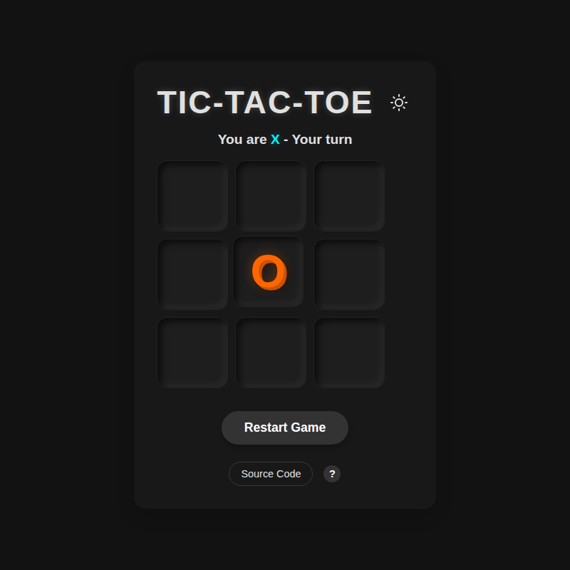
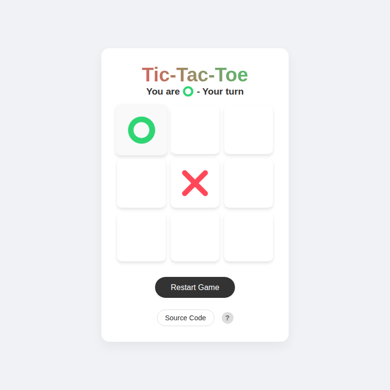
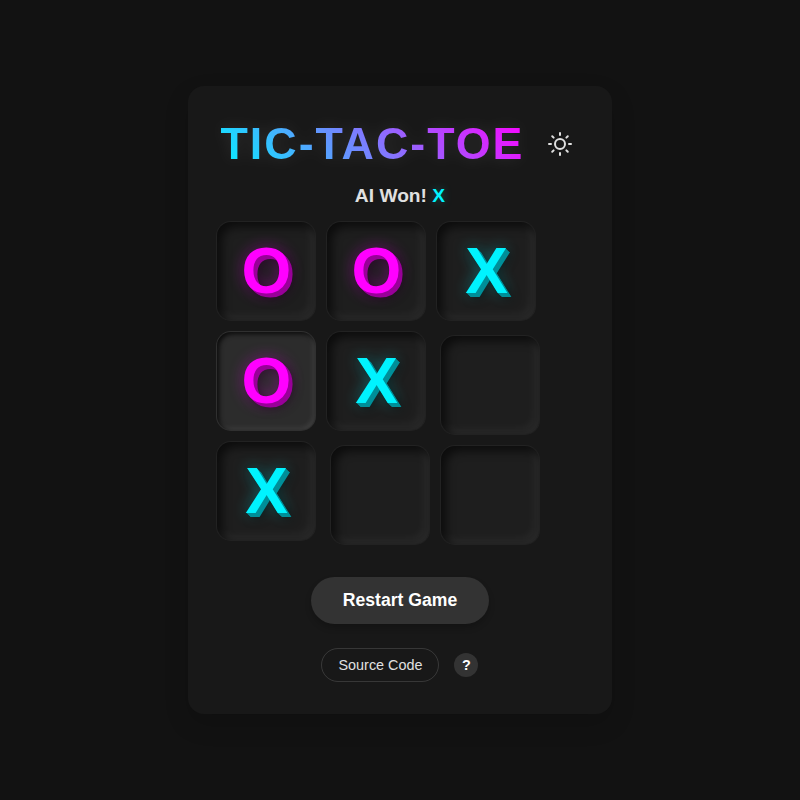

# Tic-Tac-Toe vs AI (Python/Flask) ❌⭕

This project is a modern web-based reimagining of my very first development project at **Simplon Roubaix** (Premier projet Tech IA).

## 🌟 Context & Evolution

Originally, the assignment was to create a Python script that generates a Tic-Tac-Toe game in the terminal. The requirements were:
- **Data Structure:** A dictionary representing the 9 grid cells (keys A1-C3).
- **Logic:** Functions to start the game, randomize the starting player, handle turns, and check for win/draw conditions.
- **Interface:** Command Line Interface (CLI).

**This new version** takes those fundamental concepts and elevates them into a full-stack web application to demonstrate my growth as a developer.

| Feature | Original Project (CLI) | This Project (Web App) |
| :--- | :--- | :--- |
| **Interface** | Terminal text output | Modern Responsive Web UI (HTML/CSS) |
| **Opponent** | Local PvP (Hotseat) | **Unbeatable AI** (Minimax Algorithm) |
| **Stack** | Pure Python Script | Python (Flask) Backend + REST API |
| **Deployment** | Local Execution | Cloud Deployment (Vercel) |

## 📸 Screenshots

<p align="center">
  
  
  
</p>

## 🎮 Features

- **Play vs Computer:** Challenge an AI that calculates the optimal move using the Minimax algorithm.
- **Randomized Start:** The game randomly assigns you 'X' or 'O' and decides who goes first.
- **Clean Aesthetic:** Minimalist design using system fonts and emojis for a lightweight feel.
- **Responsive:** Works seamlessly on desktop and mobile browsers.

## 🚀 How to Run Locally

1.  **Clone the repository:**
    ```bash
    git clone https://github.com/yourusername/tic-tac-toe-flask.git
    cd tic-tac-toe-flask
    ```

2.  **Install dependencies:**
    It's recommended to use a virtual environment.
    ```bash
    pip install -r requirements.txt
    ```

3.  **Run the application:**
    ```bash
    python index.py
    ```

4.  **Play:**
    Open your browser and navigate to `http://localhost:5000`.

## 🛠️ Project Structure

- `index.py`: The main Flask application containing the game routes and Minimax AI logic.
- `static/`: Contains the frontend assets (`index.html`, `style.css`, `script.js`).
- `tests/`: Unit tests to verify the game logic and AI performance.
- `vercel.json`: Configuration for deploying to Vercel.

## ☁️ Deployment

This project is configured for seamless deployment on [Vercel](https://vercel.com).
The `vercel.json` file ensures that all requests are routed to the Flask backend, which serves both the API and the static frontend files.

---
*From `print("Hello World")` to Full Stack AI Web Apps.*
